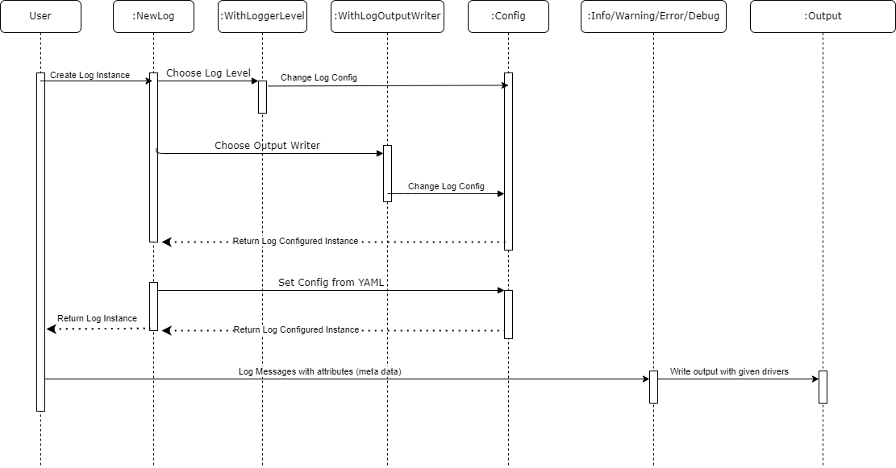
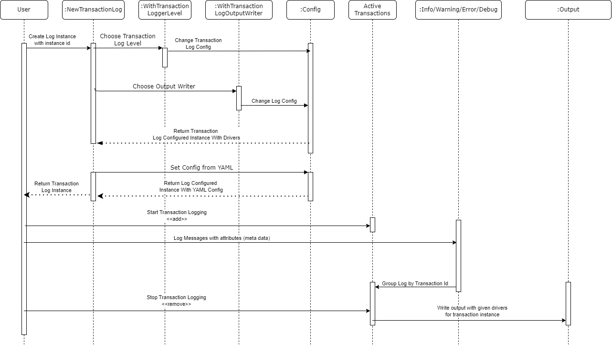

# go-telemetry

This repository contains the solution to the Coding Challenge for Plenty One.

The library implements a minimal logging tool and a transaction logging tool.

The Transaction logging tool groups individual logs to form a transaction. (e.g. Wishlist Feature: Add items to cart -> log -> Browse Similar Items -> log -> Remove an item from cart -> log...)

_The library is also thread safe_.

## Getting started

To use this lib:

- Use `logging.NewLog` to instantiate a standard log tool.


- Use `logging.NewTransactionLog` to instantiate a transaction based log tool, that groups standard logs in a transactional group.


The instances can be configured using multiple drivers:

- `logging.WithLogLevel`, `logging.WithOutputWriter` for standard logging

e.g.

```go
import "go-telemetry/pkg/logging"

func main() {
  log, err := logging.NewLog(logging.WithLogLevel(logging.LevelDebug), logging.WithLogOutputWriter(logging.JSONLogOutputFileWrite))
}
```

- `logging.WithTransactionLogLevel`, `logging.WithTransactionOutputWriter` for transaction logging

e.g.

```go
import "go-telemetry/pkg/logging"

func main() {
  transactionLog, err := logging.NewTransactionLog(logging.WithTransactionLogLevel(logging.LevelDebug), logging.WithTransacrionLogOutputWriter(logging.JSONLogOutputFileWrite))
}
```

Default configuration is `logging.LevelInfo` with `logging.CLILogOutputWrite` for standard logging and `logging.CLITransactionLogOutputWrite` for transaction logging. This configuration can be overwritten using a [YAML Configuration file](#yaml-configuration-file).

To capture transaction logs, first start the transaction using the log instance, `transactionLog.StartTransactionLogging()` and then log Info/Warning/Error/Debug.

To finish the transaction, call `transactionLog.StopTransactionLogging()`. The transaction will be printed to the desired output (default cli).

## Environment Variables

Environment variables are used to set up go-telemetry in a custom way, independent of the YAML file configuration.

```YAML
GO_TELEMETRY_FILE_PATH=<DEFAULT:telemetry-config.yml> # The path to the go-telemetry configuration YAML file. Default location is project root.
```

## YAML Configuration File

The YAML configuration file can be adjusted in order to remove the need to modify source code when for e.g. log level is adjusted.

The YAML file can be created at root level or where the GO_TELEMETRY_FILE_PATH env variabile was set.

To change configuration, use the following template:

```YAML
logger:
  level: <off|info|warning|debug|error> # Default: info, the log level
  outputWriter: <cli|jsonFile|textFile> # Default: cli, the output where the logs will be printed
  outputDir: <relative_path>            # Default: root dir, the path where the log files will be saved
```

## Test

Unit test coverage of **86.3%**.

`go test -v ./... [--cover]`

## Library Activity Diagrams

### Standard Logging



### Transaction Logging



## Library API

```go
CONSTANTS

const (
        LevelOff     loggerLevel = "off"     // 0
        LevelInfo    loggerLevel = "info"    // 1
        LevelWarning loggerLevel = "warning" // 2
        LevelError   loggerLevel = "error"   // 3
        LevelDebug   loggerLevel = "debug"   // 4
)
    Logger levels used by logger driver.


FUNCTIONS

func WithLogOutputWriter(outputWriter LogOutputWriter) func(*logging)
    WithLogOutputWriter is a pre-defined "driver" that specifies the output
    writer used

func WithLoggerLevel(loggerLevel loggerLevel) func(*logging)
    WithLoggerLevel is a pre-defined "driver" that specifies the log level used

func WithTransactionLogOutputWriter(outputWriter TransactionLogOutputWriter) func(*transactionLogging)
    WithTransactionLogOutputWriter is a pre-defined "driver" that specifies the
    transaction output writer used

func WithTransactionLoggerLevel(loggerLevel loggerLevel) func(*transactionLogging)
    WithTransactionLoggerLevel is a pre-defined "driver" that specifies the
    transaction log level used

func NewLog(options ...func(*logging)) *logging
    NewLog creates a logging instance, respective to the defined YAML
    configuration or by given "drivers" in form of options argument. The
    "drivers" have a higher priority than YAML configuration.

    The log configuration cannot be change once set.

    Default: If no configuration nor drivers are specified, the log level is
    Info with output to CLI.

func NewTransactionLog(transactionId string, options ...func(*transactionLogging)) (*transactionLogging, error)
    NewLog creates a transaction logging instance, respective to the defined
    YAML configuration or by given "drivers" in form of options argument.
    The "drivers" have a higher priority than YAML configuration.

    The transaction log configuration is set every time a transaction logging
    instance is defined.

    If a transaction with the same name is already present, the returned
    instance is nil.

    Default: If no configuration nor drivers are specified, the log level is
    Info with output to CLI.


TYPES

type LogOutputWriter func(*LoggerData) error
    A LogOutputWriter is a output writer function for standard logging.

func CLILogOutputWrite() LogOutputWriter
    CLILogOutputWrite returns an output writer that prints the logs to the CLI.

func JSONLogOutputFileWrite() LogOutputWriter
    JSONLogOutputFileWrite returns an output writer that prints the logs to a
    JSON file.

func TextLogOutputFileWrite() LogOutputWriter
    TextLogOutputFileWrite returns an output writer that prints the logs to a
    text file.

type LoggerData struct {
        LoggerLevel loggerLevel `json:"loggerLevel"`
        Timestamp   time.Time   `json:"timestamp"`
        Message     string      `json:"message"`
        MetaData    MetaData    `json:"metaData"`
}
    A LoggerData is a user defined log, that takes the timestamp of when the log
    was initialized

type MetaData = map[string]any
    A MetaData holds the log variables

type OutputWriterType string
    A OutputWriterType is a output writer driver identifier.

type TransactionLogOutputWriter func(transactionId string, startTimestamp time.Time, endTimestamp time.Time, transactionLoggerData *TransactionLoggerData) error
    A TransactionLogOutputWriter is a output writer function for transaction
    logging.

func CLITransactionLogOutputWrite() TransactionLogOutputWriter
    CLITransactionLogOutputWrite returns an output writer that prints the
    transaction log to the CLI.

func JSONTransactionLogOutputFileWrite() TransactionLogOutputWriter
    JSONTransactionLogOutputFileWrite returns an output writer that prints the
    transaction log to a JSON file.

func TextTransactionLogOutputFileWrite() TransactionLogOutputWriter
    TextTransactionLogOutputFileWrite returns an output writer that prints the
    transaction log to a text file.

type TransactionLoggerData struct {
        LoggerLevel     loggerLevel   `json:"loggerLevel"`
        TransactionLogs []*LoggerData `json:"transactionLogs"`
}
    A TransactionLoggerData holds the transaction logs for a transaction
```
